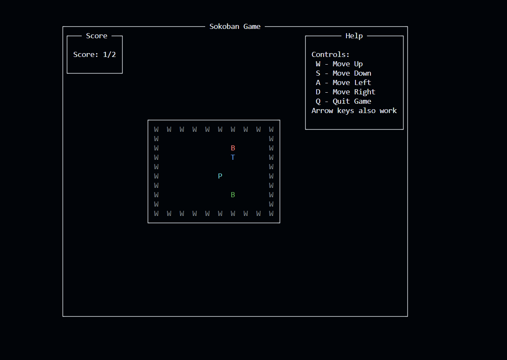
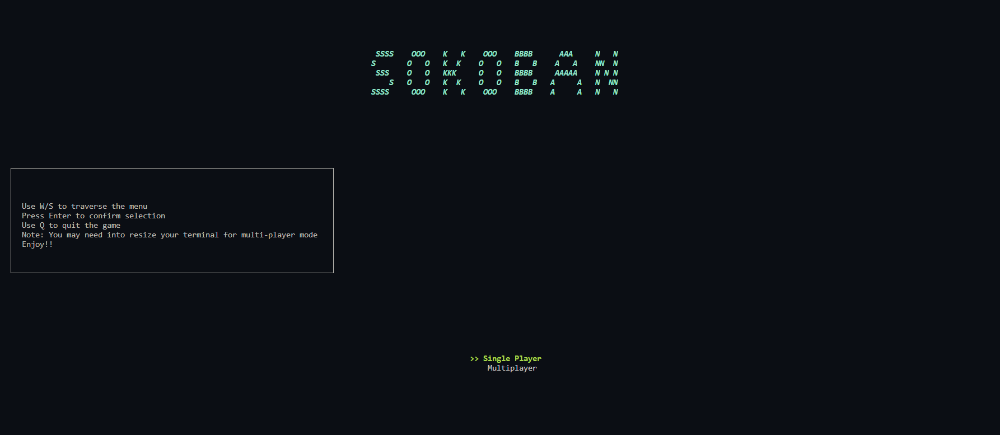
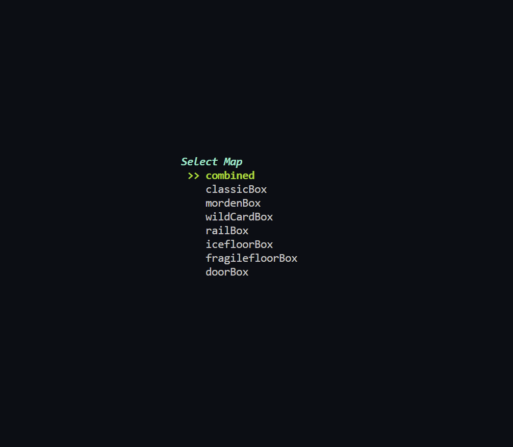
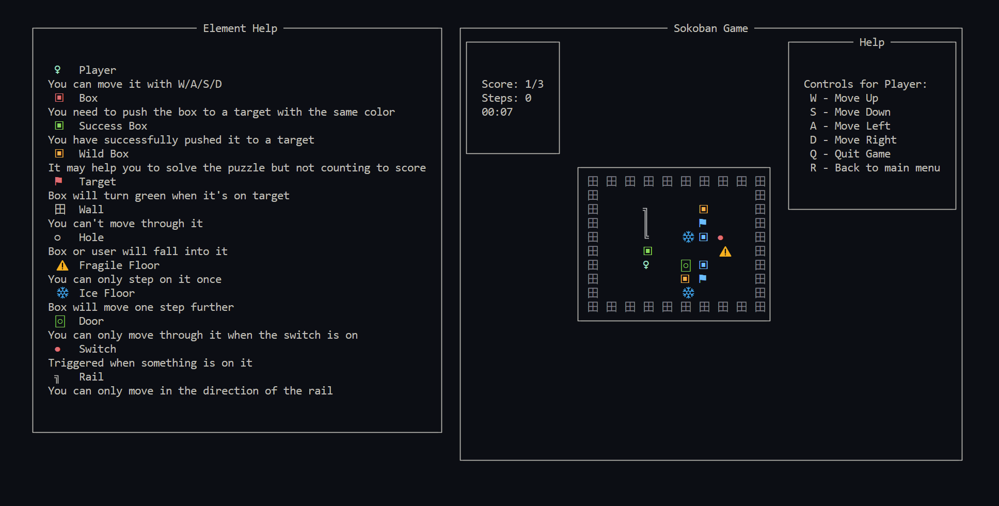
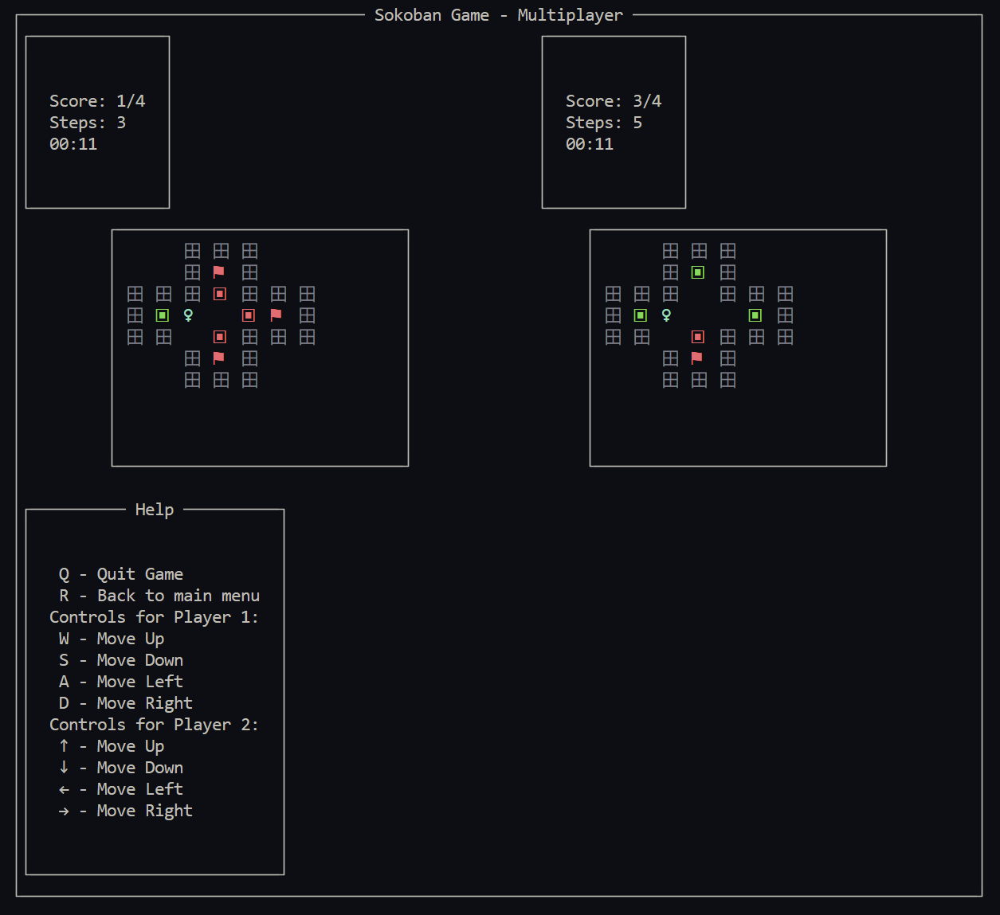
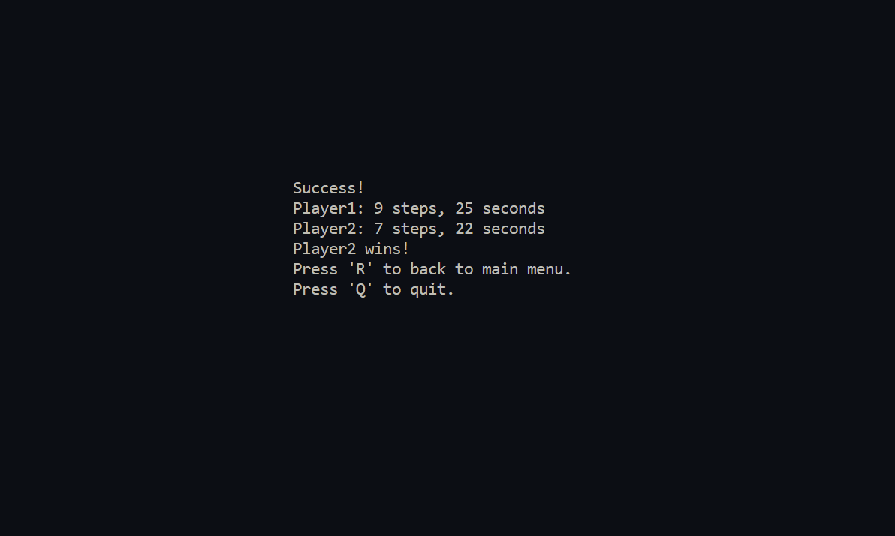

# A Sokoban Clone Implementation in Haskell

CSE 230 Project Proposal


## Team members

Yunbo Lu (PID: A59017356) yul229@ucsd.edu

Leilong Fan (PID: A59024032) lefan@ucsd.edu

Zijie Dai (PID: A59024938) z2dai@ucsd.edu

Hongbei Liu (PID: A59018257) hol033@ucsd.edu


## Project Overview

We're developing a command-line version of Sokoban using Haskell and the Brick library. In this puzzle, the player moves boxes to designated spots within a walled warehouse. Winning requires all boxes to be correctly placed. Here's a conceptual level:

```
#############
#...........#
#..####.....#
#..#..#.....#
#..#..#.....#
#..#$.#.....#
#..#..@.....#
#..#..####..#
#........#..#
#..###.###..#
#.....*.....#
#############
```

- `#` represents walls.
- `.` represents empty space.
- `$` represents a crate.
- `@` represents the player.
- `*` represents the target.

Move the crate (`$`) onto the target (`*`) to win the game.


## Expected Milestones

Though it is a very classic game, we will try to add some special components into the game. Ideally, we will manage to develop the game in different stages:

### Basic Version

The basic version will adhere to traditional Sokoban rules. We plan to develop a multi-level clone of the game in Haskell, utilizing the Brick library. This will enable users to navigate and interact within the game, consistent with the established Sokoban gameplay.

### Advanced Features

After finishing the most basic part, we will try to add the following features into the game to make it more interesting:

Subsequent versions will introduce:

- Tools (bombs, strength potions) for new strategies, like wall destruction.
- An automatic map generator that can generate different maps while ensuring the produced map is solvable.
- A challenge mode with step limits.
- Networked racing Sokoban
- ...

## Components

Currently we have identified the following crucial components of the project:

- Character movement events
- Collision Detection
- Box pushing interaction
- Game state detection (If the game has ended or not)

## Project Updates 29th Nov.

### Overview
Up to now, we have finished the first version of the game, which contains the basic playing rules like other Sokoban games.

### Game Elements

- Player (P): The player can move up, down, left, and right. Represented by cyan character P.
- Boxes (B):
    Regular Boxes: Not yet on a target, displayed in red, using character B.
    Boxes on Targets: Successfully moved to a target spot, displayed in green, using character B.
- Walls (W): Obstacles in black. Neither the player nor boxes can pass through.
- Targets (T): Designated spots for boxes, shown in blue.
- Game Board: A grid with a default size of n x n cells.

### Controls
- W / Up Arrow: Move Up
- S / Down Arrow: Move Down
- A / Left Arrow: Move Left
- D / Right Arrow: Move Right
- Q: Quit Game
- R: Restart Game

### Game Rules

The goal is to move all boxes (B) onto the targets (T). Use the controls to move the player (P) around the grid. Push boxes by moving towards them. Boxes can only be pushed, not pulled. The game is successful when all boxes are on target spots, when the user successfully finish the game, a successful message will be prompt and the user may choose to restart the game or quit the game. A scoring board is shown on top left to show how many boxes have been pushed to the target spots and how many are left.


Current game UI is as follows:  


### System Architecture

Currently we divided the UI and game logic into two parts, while file **src/app/Sokoban.hs** mainly focus on handling the game logic and game structure definition, **src/app/UI.hs** handles the UI drawing part, like Events Handling and Game Drawing. As the complexity of the game increases, we may further add Map.hs and Tool.hs into our structure.

### Challenges
Up to the basic game version, we haven't met any serious challenge. The challenges we list below are the ones that we are facing for the advanced version of the game.

- Fancier UI. We are currently trying to introduce image and Unicode characters into the UI, and the challenge is that this will cause inconsistent rendering effect due to the various spacing cost for Unicode and image. We are trying to solve this problem by dynamicly adjust the space padding based on the position of different characters.
- In addition to this, we have encountered some obstacles on the backend. We originally planned to incorporate a solver into the Sokoban game to determine whether a map is solvable. This feature would have allowed us to add many functionalities, such as challenges with a limited number of moves or random map generation. However, we encountered issues in implementing this feature. Our initial plan was to use the Breadth-First Search (BFS) algorithm, but we found it unfeasible in practice. The maps may contain multiple boxes, which can collide with each other, effectively making them movable obstacles. This significantly increases the complexity of the problem. We are currently still searching for a solution to this issue.


### Future Plan

Having met our basic goal, we are now trying to implement the advanced settings. After thorough consideration, we will adjust some of the goals we set at the very begining.

- **Tools** : We will still implement this feature  
- **Automatic Map Generator**: Since this design will not be considered much in grading and its actually a pretty complex problem, we decide to remove this goal and design the Maps manually. (But still, meaningful maps with different difficulties.)  
- **Challenge Mode with Step Limit**: Again, this is not considered much eventually and will requires an optimal solution algorithm, we will change this goal to show the steps currently used and maybe a ranking system with steps.  
- **Networked**: We now adjust this goal into a new game mode: competitive mode, where two players are allowed to play on the same computer, they will be scored based on the steps they take to finish the puzzles. Each player will play the game in two independent but same maps and do the competition, the one with lower steps that finished the game will win.

Also, we decide to add more features into the game:
1. Fancier UI: We will use unicode and images to draw prettier game UI and find a way to merge them with current brick settings.  
2. Timer and step counter
3. More environment setting: Now we are designing a new enviroment object: tube, which will limit the moving direction of the user if the user get inside of a tube.
4. More maps.

### Final Version
We have implemented all features we mentioned in the last section at this stage. Now the game has fancier UI and more interactions are allowed. Doors, Trails, fragile floor, holes.... we added many interaction elements into our game to make it more interesting. Your performance will be recorded by steps you have made and time you have used and these stats will be updated in real time. If you've passed all puzzles, we also provide competitive mode for you and your friend to test who can perform better for the same puzzle map! You can select the modes in main menu and pick the map you like. Don't worry about the various tools and different environment objects because we also provide you the introduction for them. Enjoy the game!
Major interfaces would be like the followings:  

#### Main Menu  
  
#### Map Selection   

#### Single Mode

#### Competitive Mode

#### Result Display



## Environment Setup

Requirement: Have cabal installed.  

To start the game, run the following command under folder *src*

`cabal run Sokoban`

We also implemented unit testing, run the tests via  
`cabal test`

## Acknowledgement
1. The code for our Sokoban game is original and all developed by ourselves. Before we started our project, we did look at the source code of this [snake](https://github.com/samtay/snake) game as a learning resource. This was primarily to familiarize ourselves with the Brick library and to understand the basic architecture of game design. Our reference to this snake game was minimal - only a few lines of code (< 10) for the high-level game architecture. The rest of our code is entirely written by ourselves, because our Sokoban game significantly differs in mechanics and features, not to mention the usage of Brick Library in this snake game repo is deprecated.

2. Our Sokoban game differs from the referenced snake game in every aspect. We have only learned how to use libraries, including using `Linear.V2` to conveniently represent coordinates, using `Data.Sequence` to represent a finite sequence of coordinate values, and using `Control.Lens` to easily modify the customized data type `Game` structure. The code of all features in our game are original and unique. The game's design, logic, and functionalities are completely developed by ourselves. 
